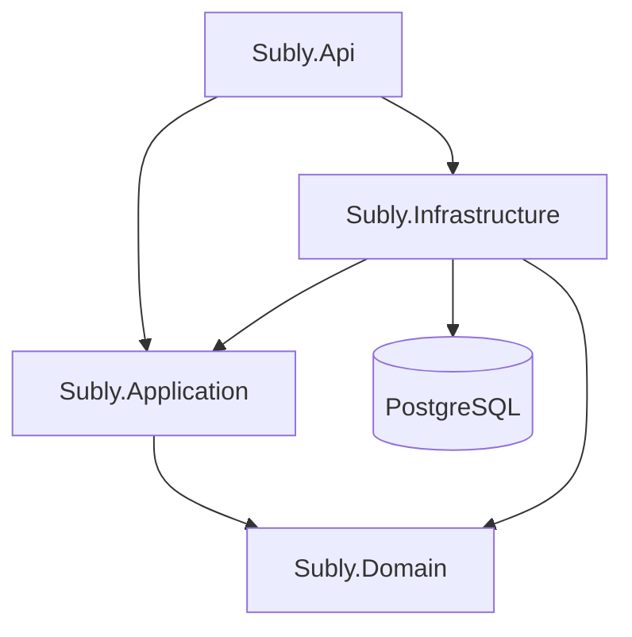
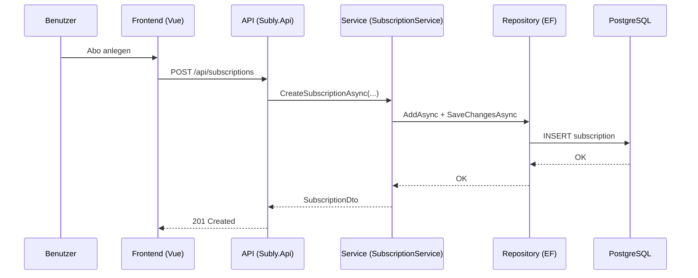

# Subly

Subly ist eine Full-Stack-Anwendung zur Verwaltung von Abonnements.  
Die App bietet ein Dashboard mit Kennzahlen (monatlich/jährlich/anstehende Zahlungen) sowie CRUD-Funktionen für Abos inkl. Statuswechsel (aktiv, pausiert, gekündigt).

## Tech-Stack

- **Frontend:** Vue 3, TypeScript, Vite, Pinia, Vue Router
- **Backend:** ASP.NET Core 9, Clean-Architecture-ähnliche Schichten (Api/Application/Domain/Infrastructure)
- **Datenbank:** PostgreSQL mit Entity Framework Core (Npgsql)
- **Orchestrierung (lokal):** .NET Aspire AppHost
- **CI/CD:** GitHub Actions → DockerHub

## Architektur

### Gesamtübersicht

```mermaid
flowchart LR
    Browser[Browser] --> Frontend[Vue SPA (Vite)]
    Frontend -->|REST /api| Api[Subly.Api]
    Api --> Application[Subly.Application<br/>SubscriptionService]
    Application --> Repository[ISubscriptionRepository]
    Repository --> Infrastructure[Subly.Infrastructure<br/>EfSubscriptionRepository]
    Infrastructure --> Db[(PostgreSQL)]
    AppHost[Subly.AppHost (Aspire)] -. startet/verdrahtet .-> Frontend
    AppHost -. startet/verdrahtet .-> Api
    AppHost -. startet/verdrahtet .-> Db
```

### Backend-Schichten und Abhängigkeiten



### Request-Flow (Beispiel)



## Projektstruktur

```text
src/
├─ backend/
│  ├─ src/
│  │  ├─ Subly.AppHost          # Aspire-Orchestrierung
│  │  ├─ Subly.Api              # REST API (Controller, Program)
│  │  ├─ Subly.Application      # Use-Cases, Services, Contracts
│  │  ├─ Subly.Domain           # Domain-Modelle
│  │  ├─ Subly.Infrastructure   # EF Core, Repository, Migrationen, Seeding
│  │  └─ Subly.ServiceDefaults  # Service Defaults/Observability
│  └─ tests/
│     ├─ Subly.Api.Tests
│     └─ Subly.Application.Tests
└─ frontend/
   ├─ src/                      # Vue App
   └─ Dockerfile
.github/
└─ workflows/
   └─ docker-publish.yml        # CI/CD: Build & Push zu DockerHub
```

## Projekt starten

### Option 1 (empfohlen): Mit .NET Aspire

Voraussetzungen:

- .NET SDK 9
- Node.js 22+
- Docker (für PostgreSQL-Container)

1. Frontend-Abhängigkeiten installieren:

   ```powershell
   cd .\src\frontend
   npm ci
   cd ..\..
   ```

2. Gesamtsystem über AppHost starten:

   ```powershell
   dotnet run --project .\src\backend\src\Subly.AppHost\Subly.AppHost.csproj
   ```

3. Im Aspire-Dashboard die Endpunkte für **frontend** und **api** öffnen.

---

### Option 2: Mit Docker Compose

Diese Variante baut und startet **PostgreSQL**, **Backend** und **Frontend** als Container.

```powershell
cd .\src
docker compose up --build
```

Danach ist das Frontend unter `http://localhost:4173` erreichbar und die API über den Frontend-Proxy unter `/api`.

Stoppen:

```powershell
docker compose down
```

---

### Option 3: Deployment mit DockerHub-Images

Diese Variante zieht fertig gebaute Images direkt von DockerHub und startet die Container — kein lokaler Build-Schritt nötig. Ideal für Produktions- oder Staging-Deployments.

#### CI/CD-Pipeline einrichten

Der GitHub Actions Workflow (`.github/workflows/docker-publish.yml`) baut bei jedem Push auf `master` (oder einem Version-Tag wie `v1.2.3`) automatisch beide Images und pusht sie zu DockerHub.

Dazu müssen in den **GitHub Repository Secrets** folgende Werte hinterlegt sein:

| Secret | Beschreibung |
|---|---|
| `DOCKERHUB_USERNAME` | Dein DockerHub-Benutzername |
| `DOCKERHUB_TOKEN` | DockerHub Access Token (unter *Account Settings → Security*) |

Die veröffentlichten Images heißen:
- `<DOCKERHUB_USERNAME>/subly-api`
- `<DOCKERHUB_USERNAME>/subly-frontend`

Tags: `latest` (master), semantische Version (z. B. `1.2.3`, `1.2`), und Git-SHA (`sha-abc1234`).

#### Deployment starten

1. Konfigurationsdatei anlegen:

   ```powershell
   cd .\src
   Copy-Item .env.deploy.example .env.deploy
   # .env.deploy öffnen und DOCKERHUB_USERNAME, POSTGRES_PASSWORD etc. befüllen
   ```

2. Container starten:

   ```powershell
   cd .\src
   docker compose -f docker-compose.deploy.yml --env-file .env.deploy up -d
   ```

Danach ist das Frontend unter `http://localhost:4173` erreichbar.

Stoppen:

```powershell
docker compose -f docker-compose.deploy.yml --env-file .env.deploy down
```

## Nützliche Kommandos

Backend-Tests:

```powershell
dotnet test .\src\backend\Subly.sln
```

Frontend-Tests:

```powershell
cd .\src\frontend
npm test
```
